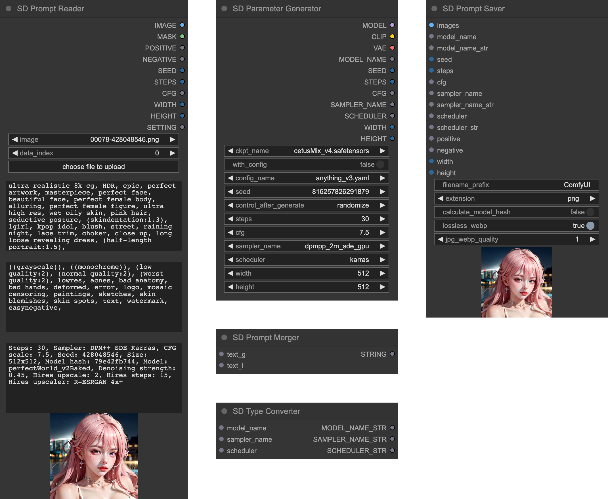
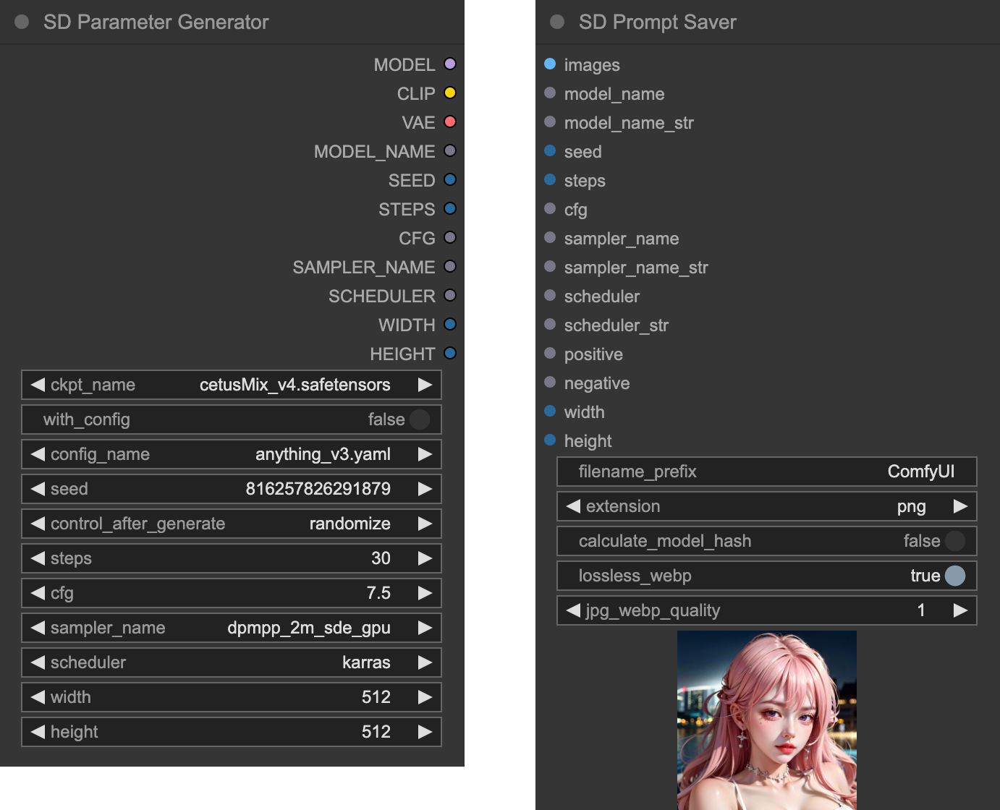
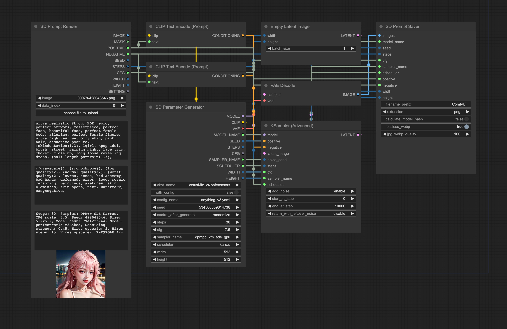

<div align="center">
    
    <h1>SD Prompt Reader Node</h1>
    <a href="https://github.com/receyuki/comfyui-prompt-reader-node/blob/master/LICENSE">
        </a>
    
    <a href="https://github.com/receyuki/stable-diffusion-prompt-reader">    
        </a>
    <a href="https://github.com/psf/black">
        </a>
    <br>
<blockquote>
This project is currently in beta status. If you encounter any issues or have any suggestions, please let me know.
</blockquote>
This is a subproject of the 
<a href="https://github.com/receyuki/stable-diffusion-prompt-reader">SD Prompt Reader.</a>
It helps you extract metadata from images in any format supported by the 
<a href="https://github.com/receyuki/stable-diffusion-prompt-reader">SD Prompt Reader</a> and saves the images with 
additional metadata to ensure compatibility with metadata detection on websites such as Civitai.
    <br>
  <p>
    <a href="#supported-formats">Supported Formats</a> •
    <a href="#installation">Installation</a> •
    <a href="#usage">Usage</a> •
    <a href="#credits">Credits</a>
  </p>
    
</div>


## Supported Formats
|                                                                          | PNG | JPEG | WEBP | TXT* |
|--------------------------------------------------------------------------|:---:|:----:|:----:|:----:|
| [A1111's webUI](https://github.com/AUTOMATIC1111/stable-diffusion-webui) |  ✅  |  ✅   |  ✅   |  ✅   |
| [Easy Diffusion](https://github.com/easydiffusion/easydiffusion)         |  ✅  |  ✅   |  ✅   |      |
| [StableSwarmUI](https://github.com/Stability-AI/StableSwarmUI)*          |  ✅  |  ✅   |      |      |
| [Fooocus-MRE](https://github.com/MoonRide303/Fooocus-MRE)*               |  ✅  |  ✅   |      |      |
| [InvokeAI](https://github.com/invoke-ai/InvokeAI)                        |  ✅  |      |      |      |
| [ComfyUI](https://github.com/comfyanonymous/ComfyUI)*                    |  ✅  |      |      |      |
| [NovelAI](https://novelai.net/)                                          |  ✅  |      |      |      |
| [Draw Things](https://drawthings.ai/)                                    |  ✅  |      |      |      |
| Naifu(4chan)                                                             |  ✅  |      |      |      |

See [SD Prompt Reader](https://github.com/receyuki/stable-diffusion-prompt-reader#supported-formats) for details

## Installation
>While ZIP package is available, it is strongly recommended not to use it for installation.
### Install and update via [ComfyUI Manager](https://github.com/ltdrdata/ComfyUI-Manager) (Recommended)
Search for `SD Prompt Reader` in the ComfyUI Manager and install it.
### Install manually
Please make sure to install the submodules along with the main repository.
1. `cd` to the `custom_node` folder
2. Clone this repo
    ```shell
    git clone --recursive https://github.com/receyuki/comfyui-prompt-reader-node.git
    ```
3. Install dependencies
    ```shell
    cd comfyui-prompt-reader-node
    pip install -r requirements.txt
    ```
#### Update
When updating, don't forget to include the submodules along with the main repository.
```shell
git pull --recurse-submodules
```

## Usage
>The following section may be outdated and could differ from the actual nodes.
### Prompt Reader Node
- The Prompt Reader Node works exactly the same as the 
[standalone SD Prompt Reader](https://github.com/receyuki/stable-diffusion-prompt-reader). 
It uses the Image Data Reader from the 
[standalone SD Prompt Reader](https://github.com/receyuki/stable-diffusion-prompt-reader), 
allowing it to support the same formats and receive updates along with the 
[SD Prompt Reader](https://github.com/receyuki/stable-diffusion-prompt-reader).   

***For images containing multiple sets of parameters, such as those processed through `hires-fix` or `refiner`, 
you will need to modify the `data_index` to select the parameters you need***   

***For images generated by SDXL and containing multiple sets of prompts, 
the text_g will be combined with text_l into a single prompt***

<div align="center">
   
</div>

### Prompt Saver Node & Parameter Generator Node
- The Prompt Saver Node and The Parameter Generator Node are designed to be used together.  
- The Prompt Saver Node will write additional metadata in the A1111 format to the output images 
to be compatible with any tools that support the A1111 format, 
including SD Prompt Reader and Civitai. 
Due to custom nodes and complex workflows potentially causing issues with SD Prompt Reader's ability 
to read image metadata correctly, it is recommended to embed this node within the workflow 
to ensure maximum compatibility.   
- Since it's not possible to directly extract metadata from KSampler, it is necessary to 
use the Parameter Generator Node to generate parameters and simultaneously output them to both 
the Prompt Saver Node and KSampler.

<div align="center">
   
</div>

### Prompt Merger Node & Type Converter Node
- Since the A1111 format cannot store `text_g` and `text_l` separately, SDXL users need to use 
the Prompt Merger Node to combine `text_g` and `text_l` into a single prompt.
- In some cases, inputs like `model_name`, `sampler_name`, and `scheduler` may conflict with other custom nodes. 
You can use the SD Type Converter to convert them into `STRING` type and then 
input them into `model_name_str`, `sampler_name_str`, and `scheduler_str`. Please note that inputs of type `STRING` 
have higher priority, so do not connect `STRING` inputs unless necessary, as the Prompt Saver will prioritize reading 
`STRING` inputs over regular ones.

<div align="center">
   
</div>

### [Example Workflow](./workflows/example_workflow.json)
>The example workflow is outdated and will be updated in the stable release.

<div align="center">
   
</div>

## Credits
- The SD Prompt Reader node is based on [ComfyUI Load Image With Metadata](https://github.com/tkoenig89/ComfyUI_Load_Image_With_Metadata)
- The SD Prompt Saver node is based on [Comfy Image Saver](https://github.com/giriss/comfy-image-saver) & [Stable Diffusion Webui](https://github.com/AUTOMATIC1111/stable-diffusion-webui)
- The seed generator in the SD Parameter Generator is modified from [rgthree's Comfy Nodes](https://github.com/rgthree/rgthree-comfy#rgthrees-comfy-nodes)
- A special thanks to [@alessandroperilli](https://github.com/alessandroperilli) and his [AP Workflow](AP Workflow) for providing numerous suggestions