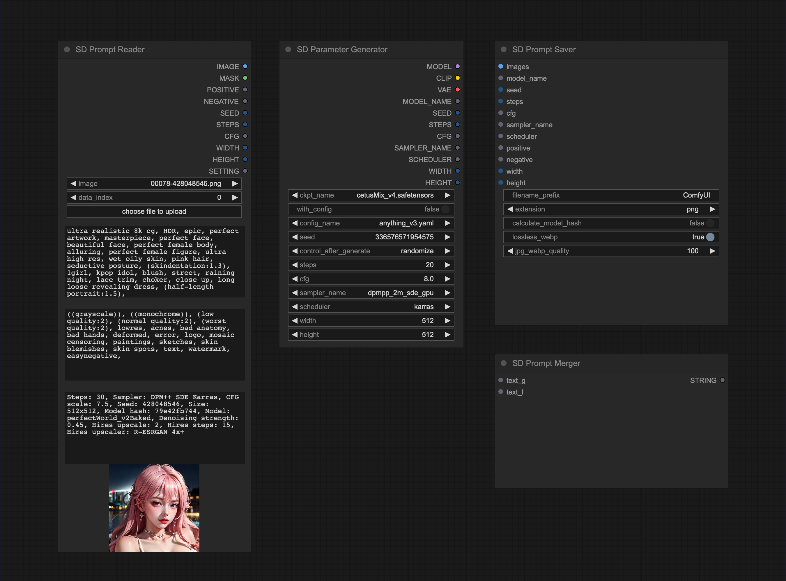

<div align="center">
    
    <h1>SD Prompt Reader Node</h1>
    <a href="https://github.com/receyuki/comfyui-prompt-reader-node/blob/master/LICENSE">
        </a>
    
    <a href="https://github.com/receyuki/stable-diffusion-prompt-reader">    
        </a>
    <a href="https://github.com/psf/black">
        </a>
    <br><br>
<h3>This project is currently in beta status. If you encounter any issues or have any suggestions, please let me know.</h3>
This is a subproject of the 
<a href="https://github.com/receyuki/stable-diffusion-prompt-reader">SD Prompt Reader.</a>
It helps you extract metadata from images in any format supported by the 
<a href="https://github.com/receyuki/stable-diffusion-prompt-reader">SD Prompt Reader</a> and saves the images with 
additional metadata to ensure compatibility with metadata detection on websites such as Civitai.
    <br>
  <p>
    <a href="#supported-formats">Supported Formats</a> •
    <a href="#installation">Installation</a> •
    <a href="#usage">Usage</a> •
    <a href="#credits">Credits</a>
  </p>
    
</div>


## Supported Formats
|                                                                          | PNG | JPEG | WEBP | TXT* |
|--------------------------------------------------------------------------|:---:|:----:|:----:|:----:|
| [A1111's webUI](https://github.com/AUTOMATIC1111/stable-diffusion-webui) |  ✅  |  ✅   |  ✅   |  ✅   |
| [Easy Diffusion](https://github.com/easydiffusion/easydiffusion)         |  ✅  |  ✅   |  ✅   |      |
| [StableSwarmUI](https://github.com/Stability-AI/StableSwarmUI)*          |  ✅  |  ✅   |      |      |
| [Fooocus-MRE](https://github.com/MoonRide303/Fooocus-MRE)*               |  ✅  |  ✅   |      |      |
| [InvokeAI](https://github.com/invoke-ai/InvokeAI)                        |  ✅  |      |      |      |
| [ComfyUI](https://github.com/comfyanonymous/ComfyUI)*                    |  ✅  |      |      |      |
| [NovelAI](https://novelai.net/)                                          |  ✅  |      |      |      |
| [Draw Things](https://drawthings.ai/)                                    |  ✅  |      |      |      |
| Naifu(4chan)                                                             |  ✅  |      |      |      |

See [SD Prompt Reader](https://github.com/receyuki/stable-diffusion-prompt-reader#supported-formats) for details

## Installation
### Install via [ComfyUI Manager](https://github.com/ltdrdata/ComfyUI-Manager) (Recommended)
~~Search for `SD Prompt Reader` in the ComfyUI Manager and install it.~~
Waiting for approval.
### Install manually
1. `cd` to the `custom_node` folder
2. Clone this repo
    ```shell
    git clone https://github.com/receyuki/comfyui-prompt-reader-node.git
    ```
3. Install dependencies
    ```shell
    cd comfyui-prompt-reader-node
    pip install -r requirements.txt
    ```
#### Update
Please ensure that you update the submodules along with the main repo.
```shell
git pull --recurse-submodules
```

## Usage
Example workflow coming soon.

## Credits
- The SD Prompt Reader node is based on [ComfyUI_Load_Image_With_Metadata](https://github.com/tkoenig89/ComfyUI_Load_Image_With_Metadata)
- The SD Prompt Saver node is based on [comfy-image-saver](https://github.com/giriss/comfy-image-saver) & [stable-diffusion-webui](https://github.com/AUTOMATIC1111/stable-diffusion-webui)