<div align="center">
    
    <h1>SD Prompt Reader Node</h1>
    <a href="https://github.com/receyuki/comfyui-prompt-reader-node/blob/master/LICENSE">
        </a>
    
    <a href="https://github.com/receyuki/stable-diffusion-prompt-reader">    
        </a>
    <a href="https://github.com/psf/black">
        </a>
    <br>

This is a subproject of the 
<a href="https://github.com/receyuki/stable-diffusion-prompt-reader">SD Prompt Reader.</a>
It helps you extract metadata from images in any format supported by the 
<a href="https://github.com/receyuki/stable-diffusion-prompt-reader">SD Prompt Reader</a> and saves the images with 
additional metadata to ensure compatibility with metadata detection on websites such as Civitai.
    <br>
  <p>
    <a href="#supported-formats">Supported Formats</a> •
    <a href="#installation">Installation</a> •
    <a href="#usage">Usage</a> •
    <a href="./CHANGELOG.md">Change Log</a> •
    <a href="#credits">Credits</a>
  </p>
    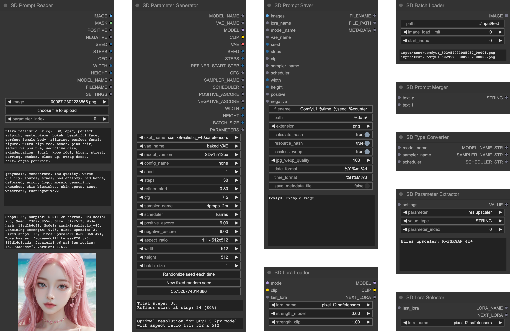
</div>


## Supported Formats
|                                                                                        | PNG | JPEG | WEBP | TXT* |
|----------------------------------------------------------------------------------------|:---:|:----:|:----:|:----:|
| [A1111's webUI](https://github.com/AUTOMATIC1111/stable-diffusion-webui)               |  ✅  |  ✅   |  ✅   |  ✅   |
| [Easy Diffusion](https://github.com/easydiffusion/easydiffusion)                       |  ✅  |  ✅   |  ✅   |      |
| [StableSwarmUI](https://github.com/Stability-AI/StableSwarmUI)*                        |  ✅  |  ✅   |      |      |
| [StableSwarmUI (prior to 0.5.8-alpha)](https://github.com/Stability-AI/StableSwarmUI)* |  ✅  |  ✅   |      |      |
| [Fooocus-MRE](https://github.com/MoonRide303/Fooocus-MRE)*                             |  ✅  |  ✅   |      |      |
| [NovelAI (stealth pnginfo)](https://novelai.net/)                                      |  ✅  |      |  ✅   |      |
| [NovelAI (legacy)](https://novelai.net/)                                               |  ✅  |      |      |      |
| [InvokeAI](https://github.com/invoke-ai/InvokeAI)                                      |  ✅  |      |      |      |
| [InvokeAI (prior to 2.3.5-post.2)](https://github.com/invoke-ai/InvokeAI)              |  ✅  |      |      |      |
| [InvokeAI (prior to 1.15)](https://github.com/invoke-ai/InvokeAI)                      |  ✅  |      |      |      |
| [ComfyUI](https://github.com/comfyanonymous/ComfyUI)*                                  |  ✅  |      |      |      |
| [Draw Things](https://drawthings.ai/)                                                  |  ✅  |      |      |      |
| Naifu(4chan)                                                                           |  ✅  |      |      |      |

See [SD Prompt Reader](https://github.com/receyuki/stable-diffusion-prompt-reader#supported-formats) for details

## Installation
> [!NOTE]
> While ZIP package is available, it is strongly recommended not to use it for installation.
### Install and update via [ComfyUI Manager](https://github.com/ltdrdata/ComfyUI-Manager) (Recommended)
Search for `SD Prompt Reader` in the ComfyUI Manager and install it.
### Install manually
Please make sure to install the submodules along with the main repository.
1. `cd` to the `custom_node` folder
2. Clone this repo
    ```shell
    git clone --recursive https://github.com/receyuki/comfyui-prompt-reader-node.git
    ```
3. Install dependencies
    ```shell
    cd comfyui-prompt-reader-node
    pip install -r requirements.txt
    ```
#### Update
When updating, don't forget to include the submodules along with the main repository.
```shell
git pull --recurse-submodules
```

## Usage
### Prompt Reader Node
<div align="center">
   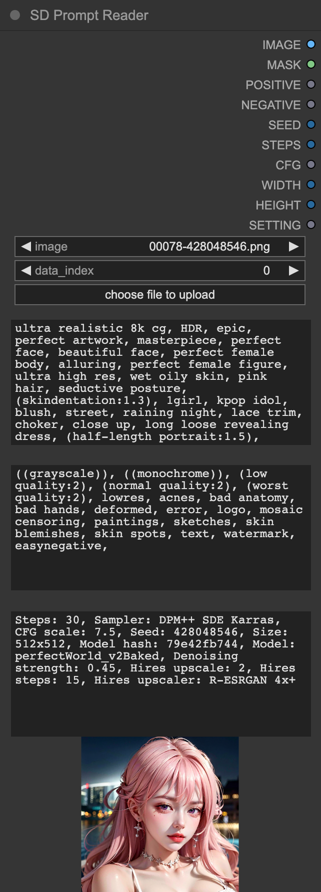
</div>

- The `Prompt Reader` Node works exactly the same as the 
[standalone SD Prompt Reader](https://github.com/receyuki/stable-diffusion-prompt-reader). 
It uses the Image Data Reader from the 
[standalone SD Prompt Reader](https://github.com/receyuki/stable-diffusion-prompt-reader), 
allowing it to support the same formats and receive updates along with the 
[SD Prompt Reader](https://github.com/receyuki/stable-diffusion-prompt-reader).
> [!IMPORTANT]
> Due to custom nodes and complex workflows potentially causing issues with SD Prompt Reader's ability 
> to read image metadata correctly, it is recommended to embed the `Prompt Saver` Node within the workflow 
> to ensure maximum compatibility.

<details>
    <summary><b>More Information</b></summary>

#### `parameter_index`
- For images containing multiple sets of parameters, such as those processed through `hires-fix` or `refiner`, 
you will need to modify the `parameter_index` to select the parameters you need
#### SDXL
- For images generated by SDXL and containing multiple sets of prompts, 
the `text_g` will be combined with `text_l` into a single prompt
#### Batch Read
- For batch processing, please use the `Batch Loader` node. When using the `Batch Loader` node for bulk reading, 
the preview image will not update, and the text box will only display the metadata of the last image.
<div align="center">
   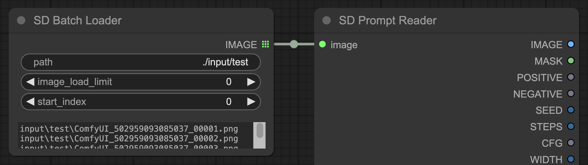
</div>

#### Additional Parameters
- To read parameters other than the existing output, please connect the `settings` to the `Parameter Extractor` node.
<div align="center">
   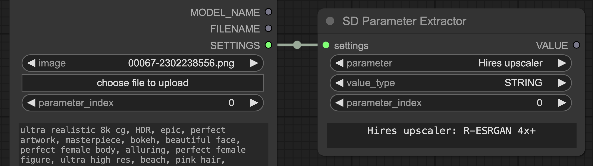
</div>

#### `MODEL_NAME`
- `MODEL_NAME` is a special output that matches the model name in the metadata with the existing models on the server 
according to the following priority:
  1. Identical path, filename, and extension.
  2. Identical filename, and extension. 
e.g. `sd_xl_base.safetensors` will be matched with `SDXL\sd_xl_base.safetensors`, and vice versa.
  3. Identical filename.
e.g. `sd_xl_base` will be matched with `SDXL\sd_xl_base.safetensors`, and vice versa.
  4. If a matching model cannot be found, the original name will be outputted.

</details>

### Prompt Saver Node
<div align="center">
   
</div>

- The `Prompt Saver` Node and the `Parameter Generator` Node are designed to be used together.  
- The `Prompt Saver` Node will write additional metadata in the A1111 format to the output images 
to be compatible with any tools that support the A1111 format, 
including SD Prompt Reader and Civitai. 
- Due to custom nodes and complex workflows potentially causing issues with SD Prompt Reader's ability 
to read image metadata correctly, it's recommended to embed this node within the workflow 
to ensure maximum compatibility.
> [!TIP]
> Since it's not possible to directly extract metadata from `KSampler`, it's necessary to 
> use the `Parameter Generator` Node to generate parameters and simultaneously output them to 
> the `Prompt Saver` Node and `KSampler` Node.

<details>
    <summary><b>More Information</b></summary>

#### Image Format
- Only PNG format supports embedding both metadata and workflow at the same time. Other formats can only embed metadata.
#### Duplicate Filename
- When the filename already exists, an index will be added at the end of the filename, 
e.g. `file.png, file_1.png, file_2.png`.
#### Hashes & Auto-Detection on Civitai
- When `calculate_hash` is enabled, the node will compute the hash values of checkpoint, VAE, Lora, 
and embedding/Textual Inversion, and write them into the metadata. After the server restarts, or a new checkpoint, 
VAE, Lora, or embedding/Textual Inversion is loaded, the first image generation may take a longer time for hash calculation. 
The hash value will be stored in temporary storage without the need for repeated calculation, 
until the server is restarted.
- When `resource_hash` is enabled, the resource hashes will be written into the metadata to support auto-detection 
on Civitai. This function will only run when `calculate_hash` is enabled.
- If you need to calculate the hash of Lora, please use the `Lora Loader` Node or the `Lora Selector` Node. 
The hash value of the embedding/Textual Inversion will be automatically detected from the prompt.
#### `save_metadata_file`
- When the `save_metadata_file` is turned on, the metadata will be saved as a TXT file with the same name
alongside the image.
#### `date_format` & `time_format`
- For the `date_format` and `time_format`, please refer to 
[strftime.org](https://strftime.org/) or [www.strfti.me](https://www.strfti.me/).
#### `filename` & `path`
- `%counter` cannot be used for `path`, it can only be used for `filename`. This `%counter` is slightly different 
from the `%counter` in the built-in `Saver` node, it will count all image files in the `path`.
- Please refer to the following table for placeholders supported by the `filename` and `path`.

   |            |            |
   |------------|------------|
   | %seed      | %date      |
   | %steps     | %time      |
   | %cfg       | %counter   |
   | %model     | %extension |
   | %sampler   | %quality   |
   | %scheduler |            |

</details>

### Parameter Generator Node
<div align="center">
   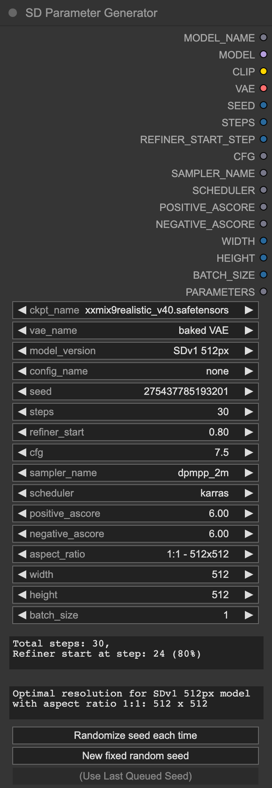
</div>

- Since it's not possible to directly extract metadata from `KSampler`, it's necessary to 
use the `Parameter Generator` Node to generate parameters and simultaneously output them to both 
the `Prompt Saver` Node and `KSampler` Node.
> [!TIP]
> The `Parameter Generator` Node can also be used as a control panel for complex ComfyUI workflows, just like the [AP workflow](https://perilli.com/ai/comfyui/).

<details>
    <summary><b>More Information</b></summary>

#### Optimal Resolution
- The `model_version` and `aspect_ratio` are used only for calculating the optimal resolution of the selected 
model version under the chosen aspect ratio. The calculation method is based on the 
[Stability AI development documentation](https://platform.stability.ai/docs/features/api-parameters#about-dimensions) 
and the [StableSwarmUI source code](https://github.com/Stability-AI/StableSwarmUI) (developed by Stability AI).
#### `refiner_start`
- `refiner_start` refers to the proportion of steps completed when the refiner starts running, 
i.e., the proportion of base steps to total steps. This is used to calculate the `start_at_step` (`REFINER_START_STEP`)
required by the refiner `KSampler` under the selected step ratio.

</details>

### Batch Loader Node
<div align="center">
   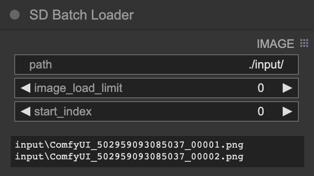
</div>

- The `Batch Loader` Node is specifically designed for the `Prompt Reader` Node to batch-read image files in a directory 
and cannot be used with other custom nodes.
<details>
    <summary><b>More Information</b></summary>

- For batch processing, please connect the `IMAGE` output of the `Batch Loader` Node to the `image` input of 
the `Prompt Reader` Node.
<div align="center">
   
</div>

#### `path`
- The `path` supports relative paths such as `./input/` or absolute paths like `C:/Users/receyuki/Pictures`.
- Both `\ ` and `/` are acceptable.
- You can also input a single file or a list of files into the `path`, 
in which case the `image_load_limit` and `start_index` will not function.

</details>

### Parameter Extractor Node
<div align="center">
   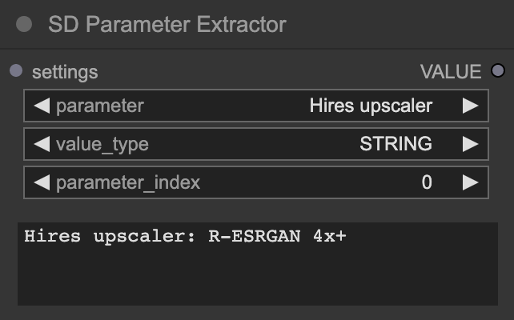
</div>

- The `Parameter Extractor` Node is an extension of the `Prompt Reader` Node, designed to retrieve the values 
of all parameters in the settings (including those parameters that the `Prompt Reader` Node cannot output). 
e.g. `Hires  upscaler`
<details>
    <summary><b>More Information</b></summary>

- Connect the `SETTINGS` of the `Prompt Reader` Node to the `settings` of the `Parameter Extractor` Node. 
After the first run, the parameter list will be loaded.
<div align="center">
   
</div>
</details>

### Prompt Merger Node & Type Converter Node
<div align="center">
   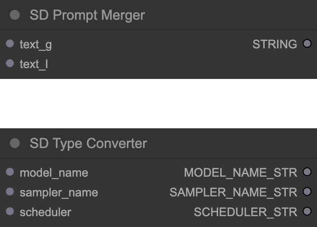
</div>

- Since the A1111 format cannot store `text_g` and `text_l` separately, SDXL users need to use 
the `Prompt Merger` Node to combine `text_g` and `text_l` into a single prompt.
- Since `model_name`, `sampler_name`, and `scheduler` are special types 
that cannot be directly used by some other nodes,
You can use the `Type Converter` Node to convert them into `STRING` type.

### Lora Loader Node & Lora Selector Node
<div align="center">
   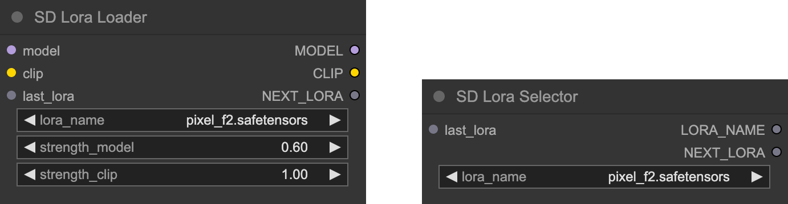
</div>

- The `Lora Loader` Node and `Lora Selector` Node are used to write Lora data into metadata and support auto-detection
on Civitai. 
<details>
    <summary><b>More Information</b></summary>

- Replace the original loader with the `Lora Loader` Node, or connect the `LORA_NAME` output of the `Lora Selector` Node
to the `lora_name` input of other lora loaders (built-in or custom), and link the `NEXT_LORA` output to the `lora_name` 
input of the `Prompt Saver` Node. Both of these nodes have the same function, please choose according to your needs.
#### Multiple Loras
- If you need to load multiple Loras, please connect the `Lora Loader` Node or `Lora Selector` Node head to tail 
through `last_lora` and `NEXT_LORA`, and connect the `NEXT_LORA` at the end of the Lora chain to the `lora_name` input 
of the `Prompt Saver` Node.
1. Lora Loader chain
<div align="center">
    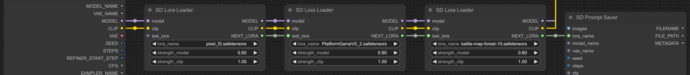
</div>

2. Lora Selector chain
<div align="center">
    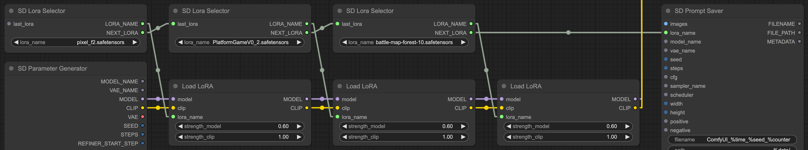
</div>

</details>

### Example Workflow
<details>
    <summary><b>Simple Example</b></summary>
<div align="center">
   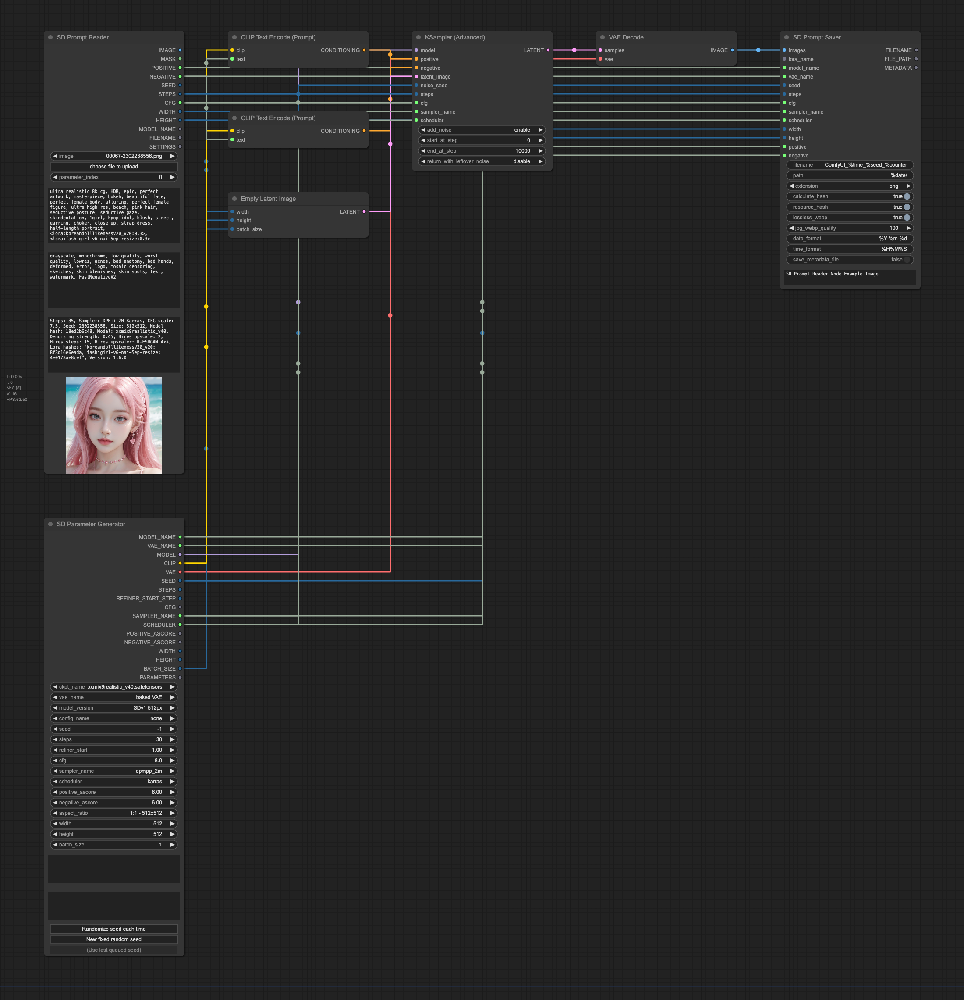
</div>
</details>

<details>
    <summary><b>Lora Example</b></summary>
<div align="center">
   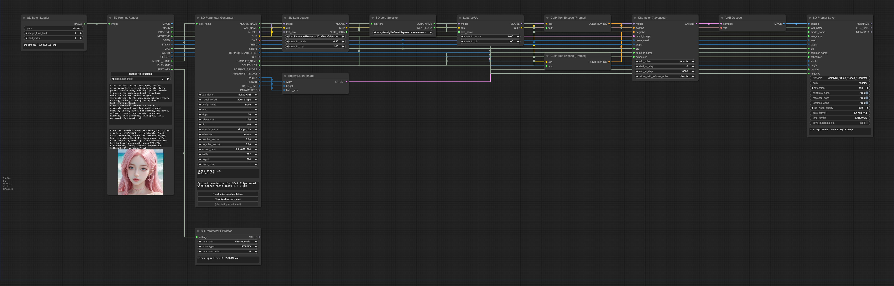
</div>
</details>

<details>
    <summary><b>Hires-fix Example</b></summary>
<div align="center">
   
</div>
</details>

<details>
    <summary><b>SDXL Example</b></summary>
<div align="center">
   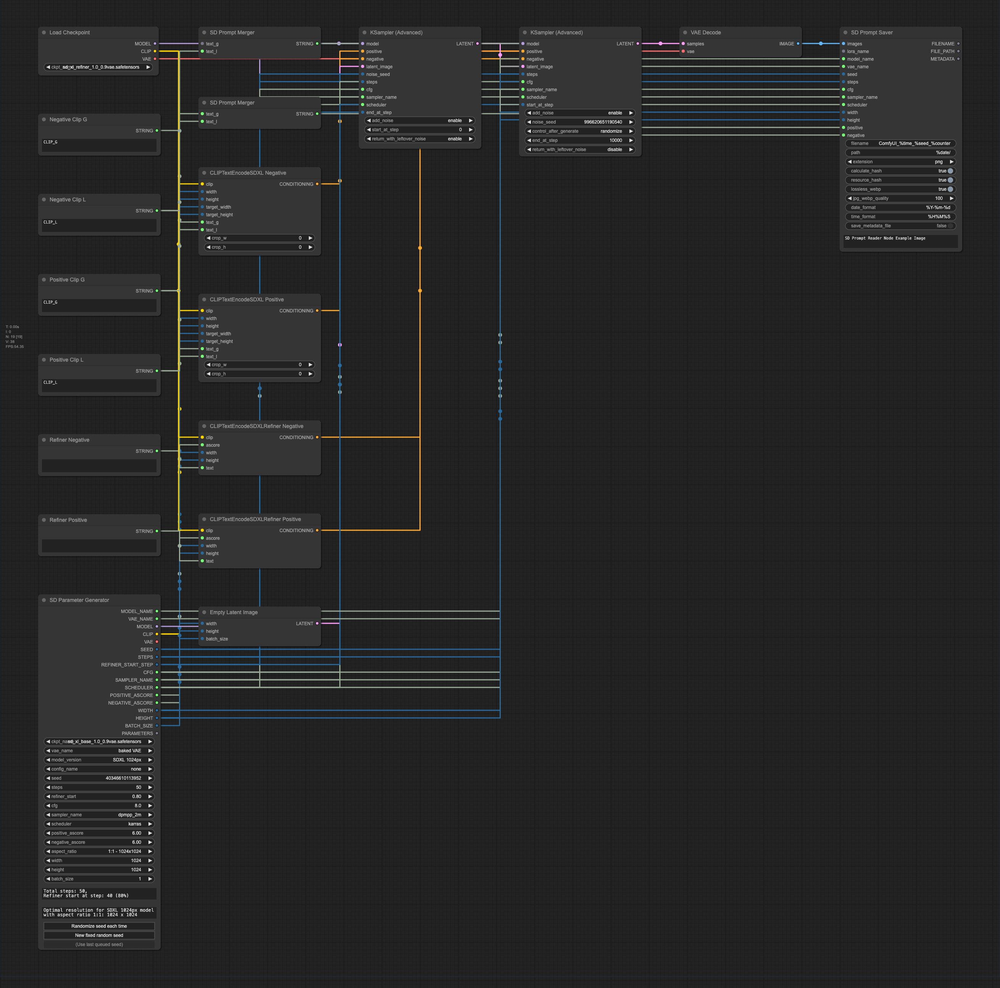
</div>
</details>


## Credits
- The SD Prompt Reader node is based on [ComfyUI Load Image With Metadata](https://github.com/tkoenig89/ComfyUI_Load_Image_With_Metadata)
- The SD Prompt Saver node is based on [Comfy Image Saver](https://github.com/giriss/comfy-image-saver) & [Stable Diffusion Webui](https://github.com/AUTOMATIC1111/stable-diffusion-webui)
- The seed generator in the SD Parameter Generator is modified from [rgthree's Comfy Nodes](https://github.com/rgthree/rgthree-comfy#rgthrees-comfy-nodes)
- A special thanks to [@alessandroperilli](https://github.com/alessandroperilli) and his [AP Workflow](https://perilli.com/ai/comfyui/) for providing numerous suggestions
